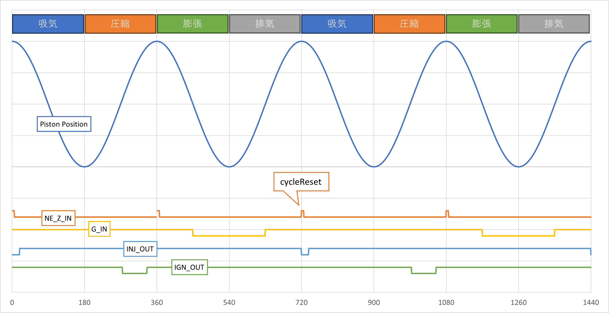

# UNOR4_Chtbi-T_EFI

Arduino UNO R4（RA4M1）/ 互換環境上で動作するエコラン車両用ECUプログラム

## 概要

- メイン周期処理: [`Routine`](src/main.cpp)
  - (AGTimerライブラリ [`AGTimer.init`](lib/AGTimer_R4_Library/src/AGTimerR4.h) による24usec毎処理)
- 割り込み:
  - 車速入力: [`WH_PULSE_ISR`](src/main.cpp)
  - クランク角 A: Arduino attachInterrupt + `ReadNe_ISR`（パルスでクランク角更新）
  - カム角: [`G_PULSE_ISR`](src/main.cpp)
- 高速 GPIO: [`fastestdigitalWrite` / `fastestdigitalRead`](src/fastestdigitalRW.hpp)
- フリータスク: FreeRTOS [`statusTask`](src/main.cpp)
  - Serial1 出力: 100ms 周期 (10Hz)
  - SerialUSB 出力: 500ms 周期 (2Hz)

## ディレクトリ構成（抜粋）

- [src/main.cpp](src/main.cpp) : コアロジック
- [src/fastestdigitalRW.hpp](src/fastestdigitalRW.hpp) : ボード別最速 GPIO
- [lib/AGTimer_R4_Library](lib/AGTimer_R4_Library) : 周期タイマ
- [platformio.ini](platformio.ini) : ビルド環境定義
- microSD/ : 走行ログや MAP 用 CSV（将来拡張）
- log/ : 記録例
- [document/arduino-workflow.puml](document/arduino-workflow.puml) : PlantUML ワークフロー図（詳細版）

## 対応ボード / ビルド

PlatformIO 環境: [platformio.ini](platformio.ini)

| Env | ボード | 備考 |
| --- | ------ | ---- |
| `uno_r4_minima` | Arduino UNO R4 Minima | デフォルト |
| `rmc_ra4m1_20` | カスタム RA4M1 (`-D rmc_ra4m1_20`) | SD動作分岐あり |
| `uno_r3` | ATmega328P | 高速GPIO分岐あり |

ビルド例:

```sh
pio run -e uno_r4_minima
pio run -e uno_r3
pio run -t upload
pio device monitor -b 115200
```

## 主要定数 / パラメータ

| 項目 | 定義 | 説明 |
| ---- | --- | ---- |
| ROUTINE_CYCLE_US | 24 | メイン周期 (µs) |
| PERIMETER_MM | 1548 | タイヤ周長(mm) |
| TACHO_RPM_MAX | 6000 | レブリミット <BR> （回転数上限保護） |
| Dwell_Time_US | 5000 | ドゥエル時間（us） <BR> IGコイルへの充電時間 |
| start_INJ_time | 80 | 始動時の燃料噴射時間（x0.1ms） |
| start_IGN_CA | 0 | 始動時の点火進角（CA） |
| start_INJ_END_CA | 20 | 始動時の燃料噴射終了タイミング角度（CA） |
| INJ_END_CA | 680 | 通常時の燃料噴射終了タイミング角度（CA） |

## ピン割り当て

- WH_IN / G_IN / STR_IN / ENGOFF_IN は `74HC14` によるシュミットトリガ回路でチャタリング防止・反転入力
- INJ_OUT / IGN_OUT / STR_OUT / DISRESET_OUT は `Nch MOSFET` による LOW アクティブ。  
- 詳細は [src/main.cpp](src/main.cpp) 参照。

| 信号 | 物理ピン | 説明 |
| ---- | -------- | ---- |
| NE_A_IN | 2 | クランク角 A (1deg/パルス) |
| NE_B_IN | 8 | クランク角 B (位相判定) |
| NE_Z_IN | 9 | クランク角0deg基準 |
| WH_IN | 3 | 車軸パルス入力 <BR> 1回転で1パルスIN |
| G_IN | 5 | カムパルス入力 <BR> クランク角720°毎に1パルス入力 |
| STR_IN | 6 | エンジンスタートスイッチ |
| ENGOFF_IN | 7 | キルスイッチ |
| INJ_OUT | A0 | 燃料噴射 (LOW=ON) |
| IGN_OUT | A1 | 点火 (LOW=ON) |
| STR_OUT | A2 | スタータリレー |
| DISRESET_OUT | A3 | リセットランプ |
| MA735_CS | 10 | MA735 SPI CS |

LOW アクティブ出力注意 (INJ/IGN/STR/DISRESET)。

## 信号イメージ



## 処理フロー概要

1. 割り込みで角度/速度更新  
   - `ReadNe_ISR`: NE_A パルスで `Ne_deg` ±1 更新（NE_Bの位相参照）  
   - `G_PULSE_ISR`: カムパルス同期フラグ設定  

   - 角度モデルと usecperdig
     - `usecperdig` は非エンコーダ・非MA735モード時にのみ補間に使用。  
       `Ne_deg += ROUTINE_CYCLE_US / usecperdig` (エンコーダ無効かつ MA735無効時)。
     - 通常は `EncoderEnabled = true` のため使用されない（初期値 `1.0`、無信号タイムアウト時にリセット）。

2. 周期関数 [`Routine`](src/main.cpp):
   - スタート/キル状態評価
   - カム同期タイムアウト→`cycleReset`
   - マップ更新: [`updateEngineMap`](src/main.cpp)
   - 噴射開始条件 (角度 >= `INJ_STR_CA`、始動時 `start_INJ_END_CA`・通常時 `INJ_END_CA` と噴射時間から逆算、0CA跨ぎ対応)
   - 360CA通過時に噴射継続中なら強制OFF（安全リセット）
   - 噴射時間経過で OFF & 燃料量積算
   - 点火進角計算 & 保持時間後 OFF

3. タスク [`statusTask`](src/main.cpp):
   - 高速パス (10Hz/100ms): Serial1 CSV出力 (`snprintf` + 一括 `write`)
   - 低速パス (2Hz/500ms): 状態計算 (燃費, 稼働時間, 速度減衰), SerialUSB 出力

## 燃料噴射計算

噴射終了角度: 始動時（`startState == LOW`）は `start_INJ_END_CA`、通常時は `INJ_END_CA`  
噴射開始角度: `INJ_STR_CA`（毎サイクルリセット時に逆算）

```text
inj_end_ca = (startState == LOW) ? start_INJ_END_CA : INJ_END_CA
INJ_STR_CA = inj_end_ca - (calculatedINJ_time * 100[µs] * 360[deg]) / tachoWidth[µs]
// INJ_STR_CA < 0 の場合（0CA跨ぎ）: INJ_STR_CA += 720
```

**0CA跨ぎ対応**: 噴射開始が720CA付近・終了が次サイクル序盤（例: 716CA→20CA）の場合、
`INJ_STR_CA` が負値になるため `+720` で正規化（0〜720CAの範囲に収める）。  
`cycleReset()` 呼び出し時に噴射継続中（`INJ_Status == 2`）であれば INJ状態をリセットせず、
タイマーで正常終了させる。  
**360CA安全リセット**: 1サイクル内で360CAを通過した時点でも噴射中の場合は強制OFFし、
意図しない噴射継続を防止（`inj360Reset` フラグで1サイクルに1回限り実行）。

噴射時間: `calculatedINJ_time` (0.1ms単位) → 実際 µs: `injDuration = calculatedINJ_time * 100`  
燃料量近似:

```text
gasml += ( (Δt * 0.0000007) + 0.0015 ) / 1.5073
```

係数は実測燃費から逆算したインジェクタ流量補正。

## 点火制御

- 進角: `calculatedIGN_CA`  
- ドゥエル時間（µs）: `Dwell_Time_US`
  - ドゥエル時間をクランク角に変換: `Dwell_Time_CA = Dwell_Time_US * 360 / tachoWidth`
- 条件: `Ne_deg >= (360 - calculatedIGN_CA - Dwell_Time_CA)` で点火 LOW  
- 保持: クランク角が `360 - calculatedIGN_CA` に達する or `Dwell_Time_US` 経過で HIGH 戻し  
- 点火: HIGH 戻しの瞬間にスパークプラグから放電

## MAP

- デフォルト MAP: `defaultMap` (RPM 昇順) → 最初の `rpm` 超過前エントリ採用。

- 列順 (SD読込も同一):  

  ```text
  rpm,inj_time(x0.1msec),ign_ca(deg)
  ```

- 拡張:  
  - SD 読み込み有効化: フラグ `SDMapEnabled = true;` + `parseCSV()` 実装  
  - AFR 補正: A/Fセンサによる燃料噴射量補正のため、`Increase_Fuel` 分岐位置あり（未実装）

## 高速GPIO

[`fastestdigitalRW.hpp`](src/fastestdigitalRW.hpp):

- AVR: `sbi/cbi` 直接制御
- UNO R4 (RA4M1): レジスタ `R_PORTx->PODR_b`
- その他: フォールバック `digitalWrite/digitalRead`

クリティカル区間 (割り込み内) の遅延最小化に寄与。

## タイマ

AGTimer: [`AGTimer.init(period_us, callback)`](lib/AGTimer_R4_Library/src/AGTimerR4.h)  
本プロジェクトでは 24µs 周期で [`Routine`](src/main.cpp) 呼び出し。  
周波数変更は `ROUTINE_CYCLE_US` を調整。

## FreeRTOS

- 監視タスク: `statusTask` (Serial1: 100ms / SerialUSB: 500ms)
- スタック: 256 words (snprintf 浮動小数点フォーマット分を含む)
- 追加タスクは `xTaskCreate` で拡張可能。スタック追加時は増量推奨。

## ログ / 出力

| ポート | 形式 | 周期 | フィールド |
| --- | --- | --- | --- |
| `Serial1` (HW UART) | CSV | **10Hz (100ms)** | RPM, INJ(ms), IGN_CA, speed, distance, fuel(ml), km/L, worktime |
| `Serial` (USB CDC) | タブ区切り | 2Hz (500ms) | 上記 + Ne_deg |

speed は 0.1km/h 分解能。停止時は最終パルス経過時間で減衰し、約8秒後に 0.0 へ。

## PlantUML 図の参照

- 図ファイル: `document/Arduino_ECU_Workflow.puml`  
- VS Code でのプレビュー: PlantUML 拡張(例: `jebbs.plantuml`)を使用して開く。  
- コマンド例 (Windows PowerShell):

```powershell
java -jar "$env:USERPROFILE\.vscode\extensions\jebbs.plantuml-2.18.1\plantuml.jar" -tsvg document/Arduino_ECU_Workflow.puml
```

- 図に含まれる主な数値注記:
  - ROUTINE_CYCLE_US = 24µs
  - PERIMETER_MM = 1548mm
  - 速度上限 99.9km/h (内部999)
  - カム同期タイムアウト ≈ 50ms
  - RPMゼロ化 ≈ 1.2s無信号
  - 速度強制ゼロ ≈ 8s無信号
  - 点火保持 5ms

## 拡張アイデア (TODO)

- [x] MAP内パラメータ選択・燃料噴射・点火処理高速化  
  (現状では処理遅れに起因すると思われる過大な進角角度を設定している)
- [ ] SD から MAP 読込実装 (`parseCSV`)
- [ ] AFR センサ補正ロジック (`updateAFR`)
- [ ] クランク角推定のドリフト補正（非エンコーダ時）
- [ ] 例外検出 (センサ断線・異常 RPM)
- [ ] フラッシュ書き込みによる学習補正保存
- [ ] 単位/係数の物理モデル化（燃料密度, 噴射流量）

## ビルドオプションフラグ

| フラグ | 影響 |
| ------ | --- |
| `uno_r4_minima` | 自動 (PlatformIO env) |
| `rmc_ra4m1_20` | SD 初期化ブロック有効 |
| `uno_r3` | AVR 高速 I/O 経路使用 |

## デバッグ

[Ardu-Stim](https://github.com/todateman/Ardu-Stim.git)の`develop/furoshiki`ブランチにある`furoshiki_2025`のパターンと、[visa-mcp](https://github.com/todateman/visa-mcp)によるオシロスコープの制御を組み合わせて、ECUプログラムのデバッグを行う。

- VISAリソース(RIGOL DHO804): `USB0::6833::1101::DHO8A253701207::0::INSTR`
- CH1: D9
- CH2: D2
- CH3: A0
- CH4: A1
- 回転数は外部から可変変化させるので、GPIOピン出力を確認して`main.cpp`の`defaultMap`に対して乖離がないか確認する
- 一度スタータボタンONの信号を入力しなければ`INJ_OUT`と`IGN_OUT`の信号出力を開始しないので、手動で実行する。

評価結果:

- [document/debug_report_20260330.md](document/debug_report_20260330.md)

## ライセンス

- 本体: リポジトリ LICENSE (MIT)
- AGTimer ライブラリ: 同梱 MIT (作者表記参照)

## 安全上の注意

実車/燃焼系制御へ適用する際は下記を検討:

- ウォッチドッグ / フェールセーフ / 過回転保護など追加必須
- 電源ノイズ対策 (車載 12V → 5V/3.3V 安定化)
- I/O レベルと駆動回路(インジェクタ / イグナイタ)の絶縁
